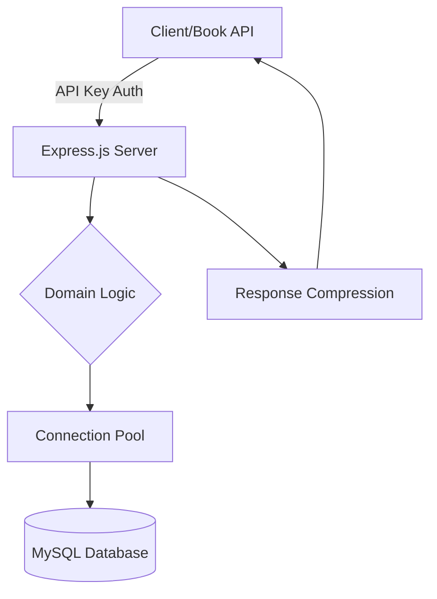

---

# 🎵 Music Catalog API

### **Tugas Akhir II3160 - Teknologi Sistem Terintegrasi**

"**Penyusun:**" Mochamad Ikhbar Adiwinangun (18223050)

---

## 📖 Ringkasan Proyek

**Music Catalog API** adalah layanan mikro yang dirancang khusus untuk efisiensi tinggi, dioptimalkan untuk dijalankan pada perangkat dengan sumber daya terbatas seperti **Set-Top Box (STB)**. Layanan ini menggunakan pendekatan **Domain-Driven Design (DDD)** untuk menyediakan data katalog musik yang akan diintegrasikan dengan API Katalog Buku melalui kecerdasan buatan (Gemini AI).



---

## 🎯 Fitur Utama

* **🚀 Optimasi STB:** Menggunakan *Connection Pool* terbatas (maks. 5) untuk menjaga stabilitas memori.
* **🔒 Keamanan:** Proteksi *API Key* untuk setiap permintaan antar-layanan.
* **📦 Batch Processing:** Mendukung pengambilan banyak data sekaligus (`batch get`) untuk efisiensi network.
* **📉 Resource Ringan:** Docker image berbasis **Alpine Linux** dengan ukuran total < 150MB.
* **⚡ Performa:** Dukungan kompresi Gzip dan paginasi ketat (10-20 item) untuk menghemat bandwidth.
* **🛠️ Maintenance:** Dilengkapi dengan *Health Check* dan *Graceful Shutdown*.

---

## 🛠️ Tech Stack

| Komponen | Teknologi |
| --- | --- |
| **Runtime** | Node.js >= 18.0.0 |
| **Framework** | Express.js |
| **Database** | MySQL 8.0+ |
| **Architecture** | Domain-Driven Design (DDD) |
| **Container** | Docker (Alpine Image) |

---

## 🚀 Panduan Instalasi

### 1. Kloning & Instalasi

```bash
git clone <repository-url>
cd TST-API
npm install

```

### 2. Konfigurasi Lingkungan

Buat file `.env` dari template yang tersedia:

```bash
cp .env.example .env

```

Isi dengan kredensial Anda:

```env
PORT=3000
DB_HOST=localhost
DB_USER=root
DB_PASSWORD=password_anda
DB_NAME=music_catalog
API_KEY=secret-key-anda

```

### 3. Persiapan Database

(Opsional) Jalankan skrip indeks untuk meningkatkan kecepatan pencarian:

```bash
mysql -u root -p music_catalog < scripts/add-indexes.sql

```

---

## 📡 Dokumentasi API

### Autentikasi

Gunakan header berikut untuk setiap permintaan (kecuali endpoint publik):
`X-API-Key: <your-secret-api-key>`

### Endpoint Utama

| Method | Endpoint | Deskripsi | Akses |
| --- | --- | --- | --- |
| **GET** | `/health` | Mengecek status kesehatan server | Publik |
| **GET** | `/music` | List semua lagu (Paginasi) | Privat |
| **GET** | `/music/:id` | Detail lagu berdasarkan ID | Privat |
| **GET** | `/music/batch` | Ambil banyak lagu (query `ids`) | Privat |
| **GET** | `/music/search` | Cari berdasarkan genre | Privat |
| **GET** | `/music/genres` | List semua genre yang tersedia | Publik |

#### Contoh Request Detail Lagu (`/music/:id`):

```json
{
  "success": true,
  "data": {
    "track_id": "123",
    "track_name": "Midnight City",
    "artists": "M83",
    "audio_features": {
      "energy": 0.8,
      "valence": 0.6,
      "tempo": 120.5
    }
  }
}

```

---

## 📊 Optimasi Kinerja STB

Untuk memastikan aplikasi berjalan stabil di hardware STB, kami menerapkan batasan berikut:

> [!IMPORTANT]
> **Konfigurasi Database Pool:**
> * `connectionLimit: 5` (Mencegah kehabisan thread MySQL)
> * `queueLimit: 10` (Membatasi antrean request)
> * `connectTimeout: 10000` (10 detik)
> 
> 

**Optimasi Payload:**

* Limit JSON Body: **100KB**
* Response Compression: **Gzip/Deflate enabled**

---

## 🐳 Deployment Docker

Layanan ini sangat disarankan dijalankan menggunakan Docker Compose:

```bash
# Build dan jalankan
docker-compose up -d

# Cek logs
docker-compose logs -f api

```

**Karakteristik Image:**

* **Base Image:** `node:18-alpine`
* **Size:** ~145MB
* **Security:** Non-root user execution

---

## 📁 Struktur Proyek

```text
TST-API/
├── src/
│   ├── domain/            # Entitas & Logika Bisnis (Abstraksi)
│   ├── infrastructure/    # Database, Repository Implementation
│   ├── interfaces/        # Controller & Route API
│   ├── middleware/        # Auth & Error Handling
│   └── server.js          # Entry Point
├── scripts/               # SQL Scripts (Indeks & Schema)
├── config/                # Manajemen Konfigurasi
├── .env.example
├── Dockerfile
└── docker-compose.yml

```

---
